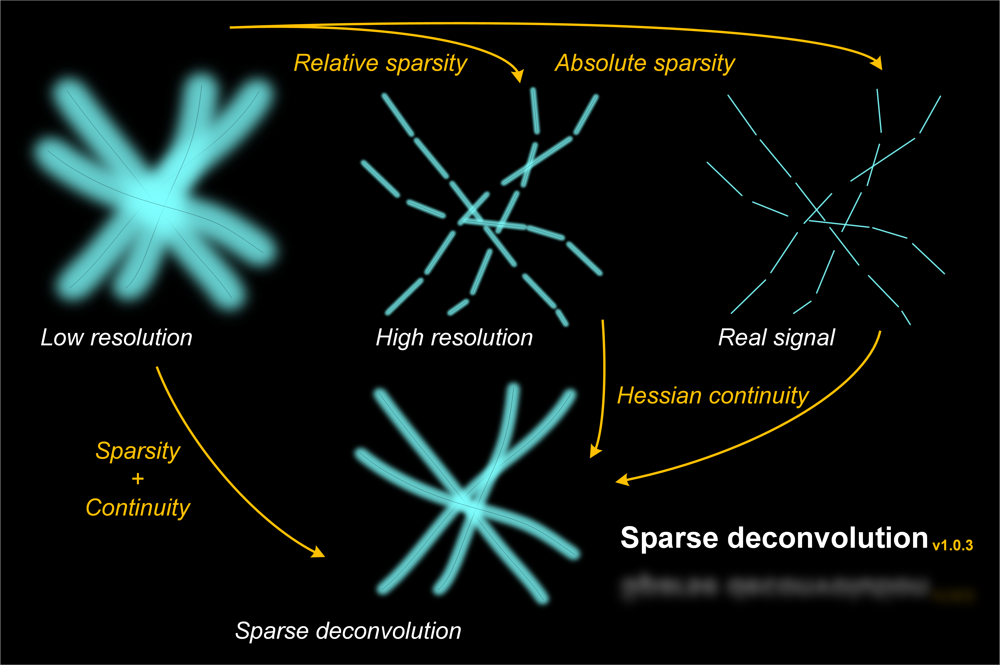

<!-- <p align='left'>
    <a href="https://weisongzhao.github.io/Sparse-SIM/"> </a>
    <a href="https://github.com/WeisongZhao/Sparse-SIM/"> </a>
    <a href="https://weisongzhao.github.io/Sparse-SIM/"></a>
    <a href="https://github.com/WeisongZhao/Sparse-SIM/releases/tag/v1.0.3/"></a>
    <a href="https://github.com/WeisongZhao/Sparse-SIM/blob/master/LICENSE/"></a>
     <a href="https://www.nature.com/nbt/"></a>
 </p> -->

[](https://github.com/WeisongZhao/Sparse-SIM/)
[](https://weisongzhao.github.io/Sparse-SIM/)
[](https://github.com/WeisongZhao/Sparse-SIM/releases/tag/v1.0.3/)
[](https://bioengineeringcommunity.nature.com/posts/physical-resolution-might-be-meaningless-if-in-the-mathematical-space)
[](https://doi.org/10.1038/s41587-021-01092-2)<br>
[](https://github.com/WeisongZhao/Sparse-SIM/)
[](https://doi.org/10.5281/zenodo.5079743)
[](https://github.com/WeisongZhao/Sparse-SIM/releases/tag/v1.0.3/) 
[](https://github.com/WeisongZhao/Sparse-SIM/blob/master/LICENSE/)<br>
[](https://twitter.com/weisong_zhao/status/1370308101690118146)
[](https://github.com/WeisongZhao/Sparse-SIM/) 
[](https://github.com/WeisongZhao/Sparse-SIM/) 
[](https://github.com/WeisongZhao/Sparse-SIM/)


<p>
<h1 align="center">Sparse deconvolution<sub>v1.0.3</sub></h1>
<!-- <h6 align="center"><sup>v1.0.3</sup></h6> -->
<!-- <h4 align="center">This repository contains the updating version of Sparse deconvolution.</h4> -->
</p>  

<p align='center'>
<i>Words written in the front: Physical resolution might be meaningless if in the mathmetical space.</i>
</p>

<p align='left'>
It is a part of publication. For details, please refer to:
</p>

<p align='center'>
  <b> <a href="https://doi.org/10.1038/s41587-021-01092-2">Sparse deconvolution improves the resolution of live-cell super-resolution fluorescence microscopy</a></b>
</p>

<p align='center'>
  <b><a href="https://weisongzhao.github.io/">Weisong Zhao</a><sup>1,3</sup>, Shiqun Zhao <sup>2,3</sup>, Liuju Li <sup>2,3</sup>,
<a href="http://homepage.hit.edu.cn/lihaoyu">Haoyu Li</a><sup>1,✉</sup></b>
<b><a href="http://www.imm.pku.edu.cn/kytd/rcdw/24147.htm">Liangyi Chen</a><sup>2,✉</sup></b>
</p>

<p align='center'>
<sup>1</sup> <a href="http://ise.hit.edu.cn/"> School of Instrumentation Science and Engineering</a>, Harbin Institute of Technology, Harbin 150080, China. 
</p> 

<p align='center'>
<sup>2</sup> <a href="http://www.biomembrane.tsinghua.edu.cn/zh/">State Key Laboratory of Membrane Biology</a>, Beijing Key Laboratory of Cardiometabolic Molecular Medicine, Institute of Molecular Medicine, Peking University, Beijing 100871, China
</p>

<p align='center'>
<sup>3</sup>Equally contributed.
</p>

The related Python version can be found at [HERE](https://github.com/WeisongZhao/sparse-deconv-py/)

You can also find some fancy results and comparisons on my [website](https://weisongzhao.github.io/MyWeb2/portfolio-4-col.html).

If you are interested in our work, I wrote a [#behind_the_paper](https://bioengineeringcommunity.nature.com/posts/physical-resolution-might-be-meaningless-if-in-the-mathmetical-space) post for further reading.

Here is also a [blog](https://weisongzhao.github.io/rl_positivity_sim/) about it for further reading.

This method has been tested on **various types of** `Confocal microscopy & STED microscopy`, `Wide-field & TIRF microscopy`, `Light-sheet microscopy`, `Multi-photon microscopy`, and `Structured illumination microscopy`, feasible for single-slice, time-lapse, and volumetric datasets. 


## Introduction
<b>This repository contains the updating version of Sparse deconvolution.</b> The Sparse deconvolution is an universal post-processing framework for fluorescence (or intensity-based) image restoration, including xy (2D), xy-t (2D along t axis), and xy-z (3D) images. It is based on the natural priori knowledge of forward fluorescence imaging model: sparsity and continuity along xy-t (z) axes. 

<p align="center">

</p>


## Instruction
- The binary executable files (.exe/.app) can be found in the [release](https://github.com/WeisongZhao/Sparse-SIM/releases)
- More details on [Wiki](https://github.com/WeisongZhao/Sparse-SIM/wiki/) and [Document](./UserManual.pdf).
- /src_unix is the source code for Unix-like systems (including MacOS).
- /src_win is the source code for Windows systems.
- Clone/download, and run the `Install.m`
- Please try help `xxx` to get the API.
```python
help SparseHessian_core
help background_estimation
help Fourier_Oversample
```

### Installation of binary executable file (.exe) for Win10 system.


[](https://www.youtube.com/watch?v=99CoWvTtQwg "")


### Or directly click the `.\for Maltab users\Sparse_SIM.exe` if you are using MATLAB 2017b.

<p align='center'>
    
</p>

## Algorithm UI

<p align="center">

</p>

- Details in the [Wiki](https://github.com/WeisongZhao/Sparse-SIM/wiki/) and [Document](./UserManual.pdf).

## Parameters: [Wiki](https://github.com/WeisongZhao/Sparse-SIM/wiki/) and [Document](./UserManual.pdf) 

## Tested platform
This software has been tested on: 
- MATLAB R2017b on (Win 10: 128 GB and NVIDIA Titan Xp: 12GB; CUDA 9.1); 
- MATLAB R2019b on (Win 10: 128 GB and NVIDIA Titan RTX: 24GB; CUDA 10.0);
- MATLAB R2019b on (Win 10: 16GB and NVIDIA GTX1050Ti: 4GB, CUDA 10.2);
- MATLAB R2015b on (CentOS 7: 64GB and Tesla K40 :12GB, CUDA 9.0);
- MATLAB R2018b on (Ubuntu 18.04: 16GB and NVIDIA TITAN Xp: 12GB, CUDA 10.1);
- MATLAB R2017b on (MacOS 10: 8GB without GPU acceleration).

More on [Wiki](https://github.com/WeisongZhao/Sparse-SIM/wiki/).

## Version
- v1.0.3 Fully open source!
- v1.0.3 Another type deconvolution, and up-sampling methods, first officially released version!
- v0.6.3 Reorder the background estimation
- v0.6.2 Debug mode
- v0.6.1 Progress bar feature and logo
- v0.5.1 Up-sampling feature and change input file type from `.mat` to `.tif`
- v0.4.1 Background estimation feature
- v0.3.0 Algorithm UI
- v0.2.0 Full model reconstruction
- v0.1.0 Sparsity reconstruction core

## Related links: 
- Python version of Sparse deconvolution: [sparse-deconv-py](https://github.com/WeisongZhao/sparse-deconv-py/)
- A light weight MATLAB library for making exsiting images to videos: [img2vid](https://github.com/WeisongZhao/img2vid/)
- An adaptive filter to remove isolate hot pixels: [Adaptive filter imagej-plugin](https://github.com/WeisongZhao/AdaptiveMedian.imagej/)
- A tool for multi-color 2D or 3D imaging: [Merge channels](https://github.com/WeisongZhao/Palette.ui)
- **Further reading:** [#behind_the_paper](https://bioengineeringcommunity.nature.com/posts/physical-resolution-might-be-meaningless-if-in-the-mathmetical-space) & [blog](https://weisongzhao.github.io/rl_positivity_sim/)
- **Some fancy results and comparisons:** [my website](https://weisongzhao.github.io/MyWeb2/portfolio-4-col.html)
- **Preprint:** [Weisong Zhao et al., Extending resolution of structured illumination microscopy with sparse deconvolution, Research Square (2021).](https://doi.org/10.21203/rs.3.rs-279271/v1)
- **Reference:** [Weisong Zhao et al., Sparse deconvolution improves the resolution of live-cell super-resolution fluorescence microscopy, Nature Biotechnology (2021).](https://doi.org/10.1038/s41587-021-01092-2)

<details>
<summary><b>Plans</b></summary>
<li> <s>Debug mode for parameter-adjustment;</s></li>
<li> <s>A Pyhton version of Sparse deconvolution;</s></li>
<li> A imagej-plugin of Sparse deconvolution;</li>
<li> A Headless mode;</li>
<li> Reduce the necessary/exposed parameters.</li>
</details>


## Open source [Sparse deconvolution](https://github.com/WeisongZhao/Sparse-SIM)

- This software and corresponding methods can only be used for **non-commercial** use, and they are under Open Data Commons Open Database License v1.0.
- Feedback, questions, bug reports and patches are welcome and encouraged!

<!-- <p align='center'>
  
  
</p> -->

